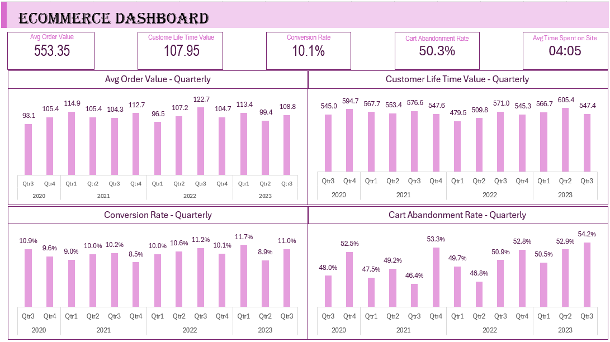

# Ecommerce Dashboard Project

#### **Description**
This eCommerce dashboard is a tool designed to provide comprehensive insights into the performance of an online store. It utilizes Excel for data analysis and visualization, offering metrics such as conversion rate, cart abandonment rate, average order value, customer lifetime value, time spent on site, top-selling products, and customer geographic distribution.

#### **Features**

- Data Visualization: Utilizes Excel's charting capabilities to visually represent key eCommerce metrics.

- Customizable: Users can customize the dashboard according to their specific needs and preferences.

- Easy to Use: Intuitive interface for easy navigation and data exploration.

- Dynamic Data: Automatically updates data and charts based on input or data refresh.

The dashboard is designed to be user-friendly, facilitating easy interpretation of complex data and fostering a data-driven decision-making culture.

#### **Technologies Used**

- **Excel Pivot**: For creating interactive and dynamic visualizations (choose as per your tool).

