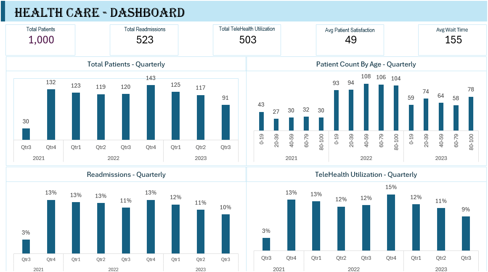

# HealthCare Dashboard Project

#### **Description**
This repository contains a healthcare dashboard designed to analyze and visualize various aspects of patient data. The dashboard includes metrics such as patient satisfaction, wait times, readmission rates, telehealth utilization, and treatments offered. The data used is anonymized to ensure patient privacy and confidentiality.

#### **Features**

- Patient Satisfaction Analysis: Evaluate patient satisfaction scores to understand patient experience.
- Wait Time Monitoring: Track the average wait times and identify potential areas for improvement.
- Readmission Rates: Analyze readmission rates to improve care quality.
- Telehealth Utilization: Monitor the adoption and effectiveness of telehealth services.
- Treatment Analysis: Review the types of treatments offered and their outcomes.

#### **Technologies Used**

- **Excel Pivot**: For creating interactive and dynamic visualizations (choose as per your tool).

