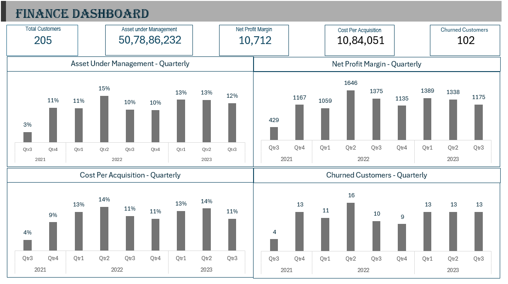

# Finance Dashboard Project

#### **Description**
This repository contains a Finance Dashboard designed to analyze and visualize various aspects of customer data in a financial context. The dashboard includes metrics such as assets under management, net profit margin, customer churn, cost per acquisition, investment types, monthly inflows and outflows, and customer feedback.

#### **Features**

- Assets Under Management: Track and analyze the total assets managed by the financial institution.

- Net Profit Margin: Monitor profitability and financial performance.

- Customer Churn Analysis: Identify and analyze churned customers to improve retention strategies.

- Cost Per Acquisition: Evaluate the cost efficiency of acquiring new customers.

- Investment Type Analysis: Understand the distribution and performance of different investment products.

- Monthly Cash Flow: Monitor monthly inflows and outflows to manage liquidity and financial health.

- Customer Feedback: Analyze customer feedback to improve service quality and customer satisfaction.

#### **Technologies Used**

- **Excel Pivot**: For creating interactive and dynamic visualizations (choose as per your tool).

