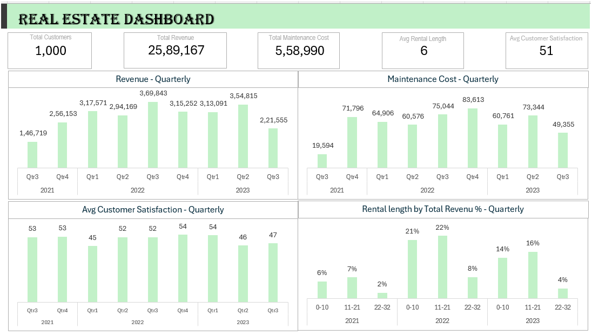

# Real Estate Dashboard Project

#### **Description**
This repository contains a Real Estate Dashboard designed to analyze and visualize various aspects of property management data. The dashboard includes metrics such as occupancy status, monthly revenue, rental length, maintenance costs, maintenance issues, and customer satisfaction.

#### **Features**

- Occupancy Tracking: Monitor the occupancy status of properties.

- Revenue Analysis: Track and analyze monthly revenue from properties.

- Rental Length: Evaluate the length of rental agreements.

- Maintenance Cost Tracking: Monitor costs associated with property maintenance.

- Issue Logging: Track maintenance issues logged for each property.

- Customer Satisfaction: Analyze customer satisfaction scores to improve service quality.

#### **Technologies Used**

- **Excel Pivot**: For creating interactive and dynamic visualizations (choose as per your tool).

