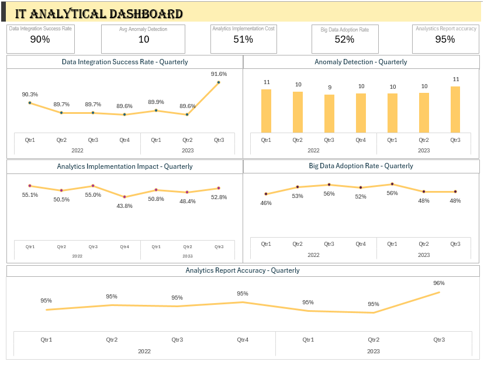

# IT Analytics Dashboard Project

#### **Description**
This repository designed to analyze and visualize various metrics related to data integration, anomaly detection, analytics implementation, big data adoption, and reporting accuracy across different departments and business units within a real estate organization.

#### **Features**

- Data Integration Success Rate: Track and analyze the success rate of data integration processes across different departments.

- Data Anomaly Detection: Monitor the occurrence and detection of anomalies in the data.

- Analytics Implementation Impact: Evaluate the impact of implementing analytics solutions on business performance.

- Big Data Adoption Rate: Monitor the rate at which big data technologies and practices are adopted.

- Analytics Reporting Accuracy: Assess the accuracy of analytics reports generated by different business units.

#### **Technologies Used**

- **Excel Pivot**: For creating interactive and dynamic visualizations (choose as per your tool).

