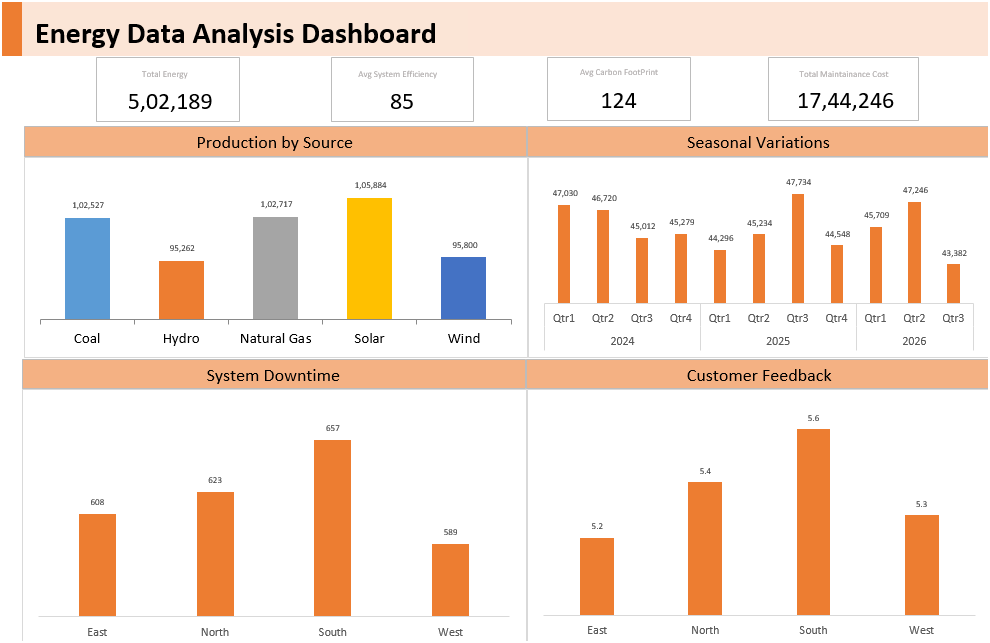

# Energy Dashboard Project

#### **Description**
The Energy Production Dashboard project aims to provide a visual representation of energy production metrics, allowing stakeholders to monitor and analyze energy production performance across different regions and energy sources. The dashboard helps in identifying trends, optimizing operations, and making data-driven decisions to improve overall system efficiency and reduce environmental impact.

#### **Features**

- Interactive Filters: Allows users to filter data based on Date, Energy Source, and Region.

- KPI Visualizations: Displays key metrics such as Energy Production, Carbon Footprint, System Efficiency, Maintenance Costs, System Downtime, and Customer Feedback Score.

- Trend Analysis: Provides trend lines and charts to analyze the performance over time.

- Geographical Insights: Maps to visualize regional data and compare energy production across different regions.

-Customizable Views: Users can customize the dashboard views to focus on specific metrics or regions of interest.

#### **Technologies Used**

- **Excel Pivot**: For creating interactive and dynamic visualizations (choose as per your tool).

