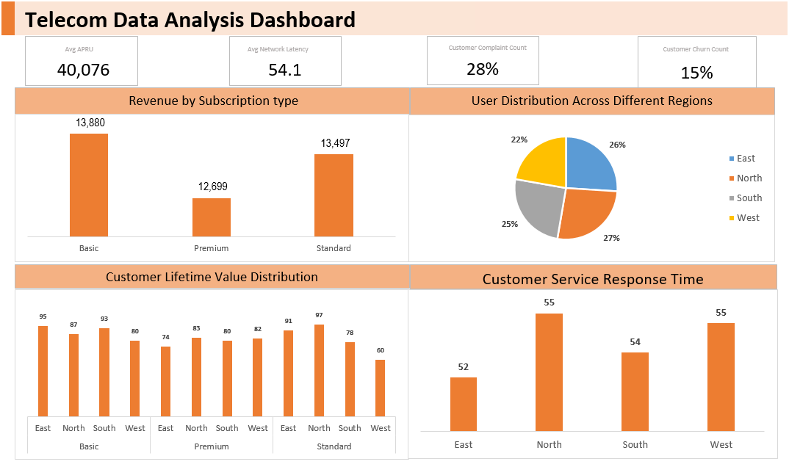

# Telecom Dashboard Project

#### **Description**
This repository contains an interactive telecom user data dashboard built using Tableau. The dashboard provides insights into telecom user data, featuring various Key Performance Indicators (KPIs) such as:

- ARPU (Average Revenue Per User)
- Churn Rate
- Network Latency
- Customer Complaints

The dataset comprises 1000 rows and includes additional information on User ID, Subscription Plan, and Region.

#### **Features**

- Interactive Filters: Allows users to filter data based on Subscription Plan and Region.

- KPI Visualizations: Displays key metrics such as ARPU, Churn Rate, Network Latency, and Customer Complaints.

- Trend Analysis: Provides trend lines and charts to analyze performance over time.

- Geographical Insights: Charts and maps to visualize regional data and compare user metrics across different regions.

- Customizable Views: Users can customize the dashboard views to focus on specific metrics or regions of interest.

#### **Technologies Used**

- **Excel Pivot**: For creating interactive and dynamic visualizations (choose as per your tool).

