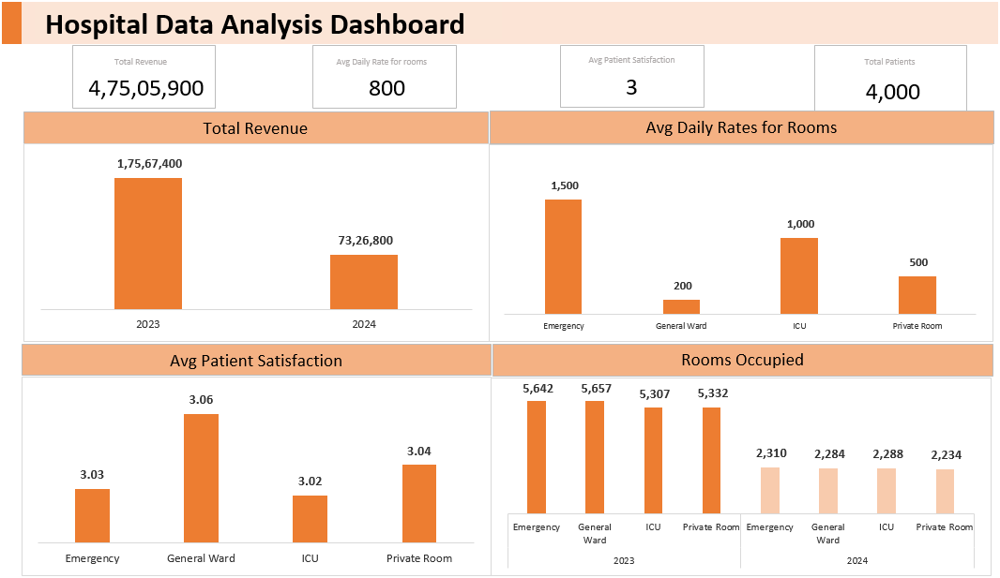

# Hospital Dashboard Project

#### **Description**
This repository contains an interactive dashboard built using Excel to analyze daily records of room usage, patient satisfaction, and reviews at a healthcare facility. The dashboard provides comprehensive insights into various metrics such as room utilization, patient satisfaction, and overall performance of different room types.

# Dataset

The dataset used in this project contains daily records with the following columns:

- Date: The date of the recorded data point.
- Room Type: The type of room (e.g., Single, Double, Suite).
- Daily Rate: The daily rate for the room.
- Room Availability: The number of available rooms of each type.
- Room Occupancy: The number of occupied rooms of each type.
- Revenue: The total revenue generated from the rooms.
- Patient Feedback: The feedback score from patients (on a scale of 1 to 10).

#### **Features**

- Interactive Filters: Allows users to filter data based on Date and Room Type.

- KPI Visualizations: Displays key metrics such as Room Availability, Room Occupancy, Revenue, and Patient Feedback.

- Trend Analysis: Provides trend lines and charts to analyze performance over time.

- Room Utilization Insights: Charts to visualize room utilization and compare performance across different room types.

- Customizable Views: Users can customize the dashboard views to focus on specific metrics or room types of interest.

#### **Technologies Used**

- **Excel Pivot**: For creating interactive and dynamic visualizations (choose as per your tool).

